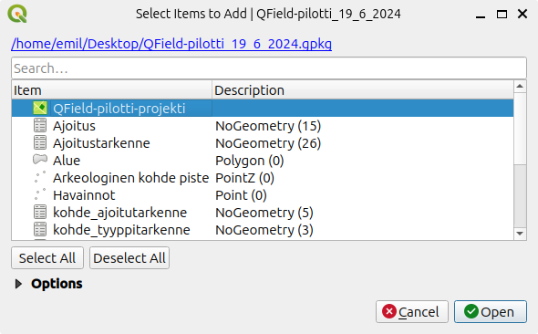

# Alkuvalmistelut

- Asenna itsellesi tietokoneelle [QGISin viimeisin vakaa versio (LTR)](https://qgis.org/fi/site/forusers/download.html).
- Asenna puhelimeesi [QField-sovelluksen sovelluskaupastasi](https://qfield.org/).
- Lataa GeoPackage-tiedosto [täältä](https://drive.google.com/file/d/1OJ9KtAqWKQuaK5Cl08BDRTUrdqtmAsgr/view?usp=sharing).

GeoPackage-tiedosto sisältää QGIS-projektin, sekä kaikki tarvittavat tasot ja taulukot. Avaa QGIS tietokoneellasi ja raahaa lataamasi GeoPackage-tiedosto QGIS-ohjelmaan. Kun päästät irti tiedostosta niin uusi ikkuna aukeaa. Valitse tästä ainoastaan *QField-pilotti-projekti* (kuten kuvassa). Silloin QGIS avaa projektin sinulle suoraan, tasot ovat valmiiksi kytketty projektiin, joten tämän takia niitä ei lisätä erikseen.

